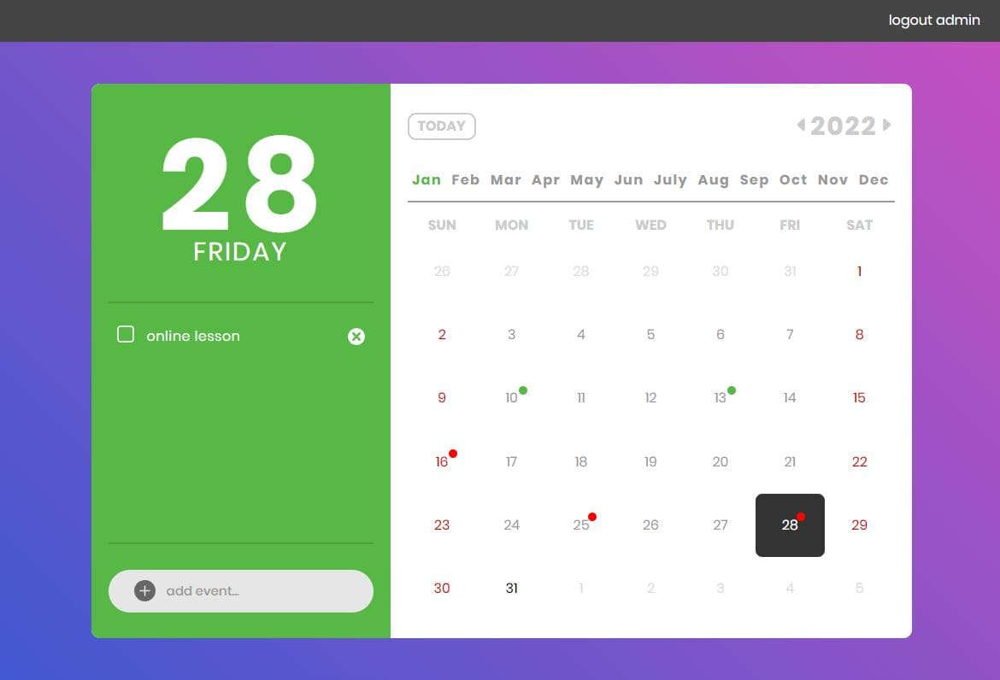

# EventCalendar
Учебный проект. TODO приложение с авторизацией и календарем
[Перейти к DEMO](https://event-calendar-black.vercel.app/)
 
## О проекте




Проект был написан с целью изучения и закрепления навыков работы с React, Redux, TypeScript и сопутствующими библиотеками. Для большего реализма, была написана имитация сервера на js, c задержкой ответа и случайной генерацией ошибок.

## Что было реализовано
**1. Навигация**
> для навигации использовалась библиотека react-router

- разная навигация для авторизованных и не авторизованных пользователей

**2. Формы авторизации и регистрации**
> для создания форм использовалась библиотека **react-hook-form**

- валидация полей, в том числе кастомная
- иконки внутри поля с пакета **react-icons**
- изменение оформления поля при появлении ошибки
- иконка со всплывающей ошибкой
- блокировка отправки формы до её правильного заполнения
- анимация кнопки после отправки данных
- ошибки авторизации и регистрации отображаются во всплывающем окне

**3. Календарь**
> для реализации календаря была написана обертка над компонентом из
> библиотеки **react-calendar**.

- изменены стандартные стили
- реализованы собственные компоненты выбора года и месяца
- реализована кнопка "Today"
- даты, на которые запланированы события обозначены специальной меткой. Если все события, запланированные на этот день выполнены, то метка ***зеленая***, если нет, то ***красная***
- нельзя создавать события на прошедшую дату, но можно их просматривать. Для этого организована специальная проверка.

**4. Список событий**
- отображение событий, запланированных на выбранную дату
- анимированное удаление событий
- отметка события как выполненного

**5. Форма для создания новых событий**
**6. Асинхронные запросы**
> для выполнения асинхронных запросов к серверу использовались библиотеки **redux-thunk** и **axios**
- во время асинхронных запросов отображается **loader**
- ошибки, при выполнении асинхронных запросов, отображаются во всплывающем окне

**7. Асинхронная загрузка компонента (React.lazy)**

## Для запуска

1. Клонируем репозиторий

```sh
git clone https://github.com/Perevoznikov/EventCalendar.git
```

2. Устанавливаем необходимые зависимости

```sh
npm install
```

3. Запускаем сборку проекта

```sh
npm start
```


## Authors
[Perevoznikov Vladimir](https://github.com/Perevoznikov/) 